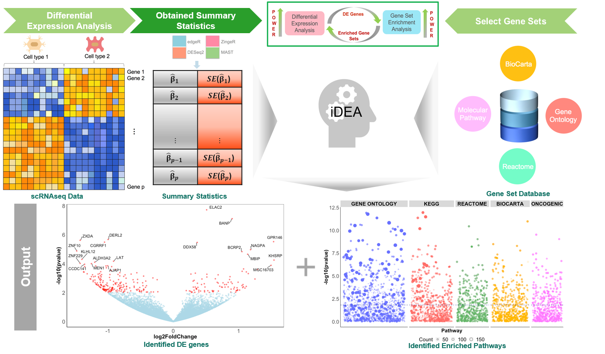

---
#
# By default, content added below the "---" mark will appear in the home page
# between the top bar and the list of recent posts.
# To change the home page layout, edit the _layouts/home.html file.
# See: https://jekyllrb.com/docs/themes/#overriding-theme-defaults
#
layout: home
author: "Shiquan Sun, Ying Ma and Xiang Zhou"
date: '2019-02-08'
output:
pdf_document: default
html_document: default
md_document:
variant: markdown_github
---



## Preparing input data
------------

`iDEA` requires gene-level summary statistics in terms of fold change/effect size estimates and their variances as inputs, which can be obtained using any existing single-cell RNAseq DE approaches (i.e., [zingeR](https://genomebiology.biomedcentral.com/articles/10.1186/s13059-018-1406-4), [MAST](https://genomebiology.biomedcentral.com/articles/10.1186/s13059-015-0844-5), etc.). Also `iDEA` requires a corresponding gene specific annotations, which are from the public databases (i.e., [KEGG](https://www.genome.jp/kegg/), [Reactome](https://reactome.org/), etc.). With DE test statistics as inputs, iDEA builds upon a hierarchical Bayesian model for joint modeling of GSEA and DE analysis.

### 1. Summary statistics, e.g.,
```
          beta   beta_var
A1BG     -1.028331e-02 0.005304736
A1BG-AS1 -2.173872e-03 0.008438381
A2M       8.671972e-06 0.002353646
...
```
The summary statistics file should be in  `data.frame` data format with row names, while the column names are not required but the order of the column matters: the first column should be the coefficient and the second column should be the variance of the coefficient for each gene. Alternatively, the raw count matrix and their corresponding cell type labels are also allowed in iDEA to obtain the summary statistics if you have no summary data.

### 2. Gene specific annotations,  e.g.,
```
          annot1  annot2
A1BG     0      1
A1BG-AS1 1      0
A2M      0      0
...
```
The gene specific annotation file is required `data.frame` data format with row names, while the header is allowed but not required.


## Getting started
-------------
```r
library(iDEA)
``` 

### 1. Load summary statistics and annotations
In this tutorial, we will apply `iDEA` on a sample data from human embryonic stem cell from [Chu et al](https://genomebiology.biomedcentral.com/articles/10.1186/s13059-016-1033-x) to detect DE genes and enriched pathways. The summary statistics of DE analysis has been prepared by [zingeR-DESeq2](https://github.com/statOmics/zinbwaveZinger) method. The row names of annotation file should match exactly with row names of summary statistics and should be in the same type, i.e. gene symbol or transcription id etc. If not, one solution is to use `biomaRt` R package to convert the gene name to make sure they are consistent each other.

The example data can be downloaded [here](https://github.com/xzhoulab/iDEA/blob/master/data/annotation.RData) for annotations, and [here](https://github.com/xzhoulab/iDEA/blob/master/data/summary.RData) for summary statistics.

Load annotation data,
```r
load("./annotation.RData")
head(annotation_data[,1:3])
```
```
##           GO_CELLULAR_RESPONSE_TO_LIPID GO_SECRETION_BY_CELL
## A1BG                              0                    1
## A1CF                              0                    0
## A2LD1                             0                    0
## A2M                               0                    1
## A2ML1                             0                    0
## AAAS                              0                    0
##       GO_REGULATION_OF_CANONICAL_WNT_SIGNALING_PATHWAY
## A1BG                                                 0
## A1CF                                                 0
## A2LD1                                                0
## A2M                                                  0
## A2ML1                                                0
## AAAS                                                 0
```

Load summary data,
```r
load("./summary.RData")
head(summary_data)
```

```
##         log2FoldChange      lfcSE2
## A1BG      0.90779290 0.25796491
## A1CF      0.36390514 0.03568627
## A2LD1     0.03688353 0.75242959
## A2M       8.54034957 0.40550678
## AAAS      0.19593275 0.15456908
## AAK1      2.43579392 0.02828550
```

If there are no summary data available, the count matrix and cell types are allowed as inputs to obtain the summary data, e.g.,

``` 
idea <- CreateiDEAObject(annotation=annotation_data,counts=counts,cell_type=cellType)
```

### 2. Create an `iDEA` object
We encourage the user set `num_core > 1` if a large number of annotations is as input (`Linux` platform; for `Windows` platform, the `num_core` will be set 1, automatically). 

```r
idea <- CreateiDEAObject(summary_data, annotation_data, num_core=10)
```
The data are stored in `idea@summary` and `idea@annotation`.
```r
head(idea@summary)
```

```
##           beta      beta_var
## A1BG      0.90779290 0.25796491
## A1CF      0.36390514 0.03568627
## A2LD1     0.03688353 0.75242959
## A2M       8.54034957 0.40550678
## AAAS      0.19593275 0.15456908
## AAK1      2.43579392 0.02828550
```

```r
head(idea@annotation[[1]])
```
```
##  20 34 45 46 87 99
```
The gene indices which are annotated as 1.

### 3. Fit the model
iDEA relies on an expectation-maximization (EM) algorithm with internal Markov chain Monte Carlo (MCMC) steps for scalable model inference. The results are stored in `idea@emmcmc`.

```r
idea <- iDEA.fit(idea) ## model fitting
```

```
## ===== iDEA INPUT SUMMARY ==== ##
## number of annotations:  100 
## number of genes:  7636 
## number of cores:  10 
## fitting the model with annotation ... 
  |======================================                                       |  50%, ETA 03:30
```

### 3. Correct p-values
iDEA utilizes [Louis method](https://www.jstor.org/stable/2345828) to compute calibrated p-values for testing gene set enrichment, while simultaneously producing powerful posterior probability estimates for each gene being DE. The results are stored in `idea@louis`.

```r
idea <- LouisCorrect(idea) ## 
```

```
## ===== LOUIS METHOD ==== ##
## correcting p-values ...
|======================================                                       | 50%
```

```
head(idea@louis)
```
