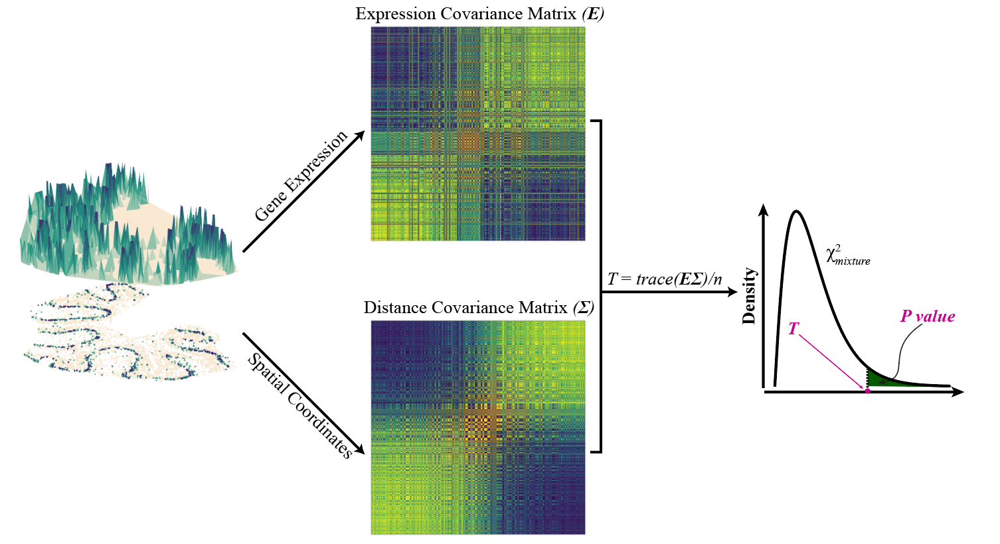

---
#
# By default, content added below the "---" mark will appear in the home page
# between the top bar and the list of recent posts.
# To change the home page layout, edit the _layouts/home.html file.
# See: https://jekyllrb.com/docs/themes/#overriding-theme-defaults
#
layout: home
author: "Shiquan Sun, Jiaqiang Zhu and Xiang Zhou"
date: '2020-10-15'
fontsize: 10pt
linkcolor: blue
mainfont: Times
output:
pdf_document: default
html_document: default
md_document:
variant: markdown_github
---

**SPARK** is a R package developed to identify genes with spatial expression pattern in spatially resolved transcriptomic studies. 

## SPARK  

*SPARK* directly models count data generated from various spatial resolved transcriptomic techniques through generalized spatial linear models. It relies on penalized quasi-likelihood algorithm for scalable computatation and recently developed statistical formulas for hypothesis testing, providing effective control of type I errors and yielding high statistical power. 

**Recommend Application**: Sample size smaller than 3,000, with relatively low sparsity structure. 
**Example Analysis with SPARK**:[here](https://xzhoulab.github.io/SPARK/02_SPARK_Example/).

## SPARK-X
*SPARK-X* builds upon a robust covariance test framework to model a wide variety of spatial transcriptomics data collected through different technologies. It relies on algebraic innovations for scalable computatation as well as newly developed statistical formulas for hypothesis testing, producing well-calibrated p-values and yielding high statistical power. SPARK-X is highly computationally efficient and the **only** SE method scalable for the HDST data.

**Recommend Application**: Sample size greater than 3,000, works well regardless of the sparsity structure.  
**Example Analysis with SPARK-X**:[here](https://xzhoulab.github.io/SPARK/02_SPARK_Example/).
